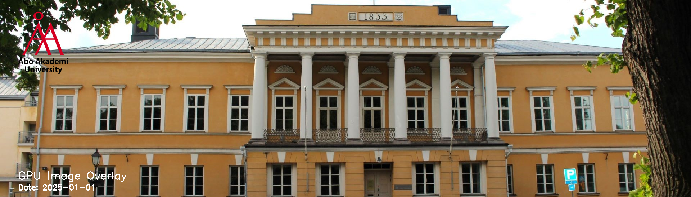

# GPU-Based Image Overlay System

## Project Goal
The goal of this project is to develop a system that automatically overlays a **title**, a **logo**, and a **date** onto an image.  
This functionality is commonly used for **timestamping**, **branding**, and **text annotation** in image production workflows.

## Use of GPU Computing
GPU computing is essential for this project because applying overlays requires **processing every pixel** of an image.  
Images can contain millions of pixels, and each overlay operation involves **pixel-level blending** of text and graphics.

By leveraging **GPU parallelism** (CUDA / OpenCL), the system can process thousands of pixels simultaneously, resulting in a **significant performance improvement** compared to traditional CPU-based processing.

## Expected Outcome
The expected outcome is a program that:
- Takes an **input image**
- Takes a **logo**
- Adds a **title and date overlay**
- Outputs a **new processed image**

The project will demonstrate the **performance advantages of GPU acceleration** over CPU processing, potentially achieving much faster execution times.

## Example input

## Logo

## Example Output

